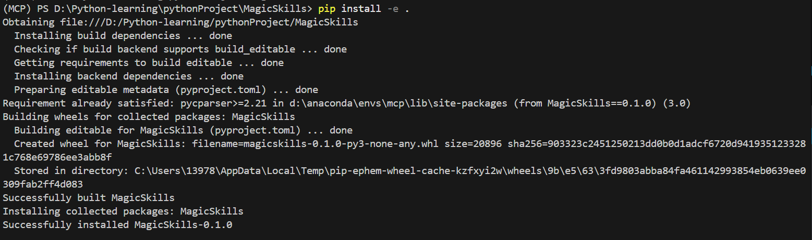

# Windsurf

## Windsurf启动

## 安装magicskills

首先 `git clone https://github.com/Narwhal-Lab/MagicSkills.git`

并执行  `pip install -e .` 指令



本文的示例 skill 以 **`docx`** 为例


### 安装 skill(之前已经下载过的可以选择跳过)

执行 `magicskills install anthropics/skills -t ~/allskills`

(笔者在 Claude Code教程上安装过，故次跳过)

### 创建skills

执行 `magicskills createskills windsurf --skill-list docx --agent-md-path ./AGENTS.md`

### 生成 AGETNS.md

执行 `magicskills syncskills windsurf --output ./AGENTS.md -y` 指定输出AGENTS.md路径，不指定时候就默认用`createskills`指定的`--agent-md-path ./AGENTS.md`
此时AGENTS.md会出现如下内容

```markdown
# AGENTS

<skills_system priority="1">

## Available Skills

<!-- SKILLS_TABLE_START -->
<usage>
When users ask you to perform tasks, check if any of the available skills below can help complete the task more effectively.

How to use skills:
Unified skill cli. If you are not sure, you can first use "magicskills listskill" to search for available skills. Then, determine which skill might be the most useful. After that, try to use "magicskills readskill <path>" to read the SKILL.md file under this skill path to get more detailed information. Finally, based on the content of this file, decide whether to read the documentation in other paths or use "magicskills execskill <command>" to directly execute the relevant script.

Usage notes:
- Only use skills listed in <available_skills> below
- Do not invoke a skill that is already loaded in your context
</usage>

<available_skills>

<skill>
<name>docx</name>
<description>Use this skill whenever the user wants to create, read, edit, or manipulate Word documents (.docx files). Triggers include: any mention of 'Word doc', 'word document', '.docx', or requests to produce professional documents with formatting like tables of contents, headings, page numbers, or letterheads. Also use when extracting or reorganizing content from .docx files, inserting or replacing images in documents, performing find-and-replace in Word files, working with tracked changes or comments, or converting content into a polished Word document. If the user asks for a 'report', 'memo', 'letter', 'template', or similar deliverable as a Word or .docx file, use this skill. Do NOT use for PDFs, spreadsheets, Google Docs, or general coding tasks unrelated to document generation.</description>
<path>C:\Users\13978\allskills\docx</path>
</skill>

</available_skills>
<!-- SKILLS_TABLE_END -->

</skills_system>

```


### 使用

输入：请你阅读当前目录下的AGENTS.md文件，生成一份你的自我介绍，保存在 .docx 文档中

### 结果如下

```bash
请你阅读当前目录下的AGENTS.md文件，生成一份你的自我介绍，保存在 .docx 文档中

I'll read the AGENTS.md file first to understand the content, then create a self-introduction based on it and save it as a .docx document.

Now I'll use the docx skill to create a self-introduction document. First, let me check what commands are available in the docx skill.

Let me try to read the docx skill directly to understand how to use it:

magicskills readskill C:\Users\13978\allskills\docx
magicskills : 无法将“magicskills”项识别为 cmdlet、函数、脚本文件或可运行程序的名称。请检查名称的拼写，如果包括路径，请确保路径正确，然后再试一次。
所在位置 行:1 字符: 1
+ magicskills readskill C:\Users\13978\allskills\docx
+ ~~~~~~~~~~~
    + CategoryInfo          : ObjectNotFound: (magicskills:String) [], CommandNotFoundException
    + FullyQualifiedErrorId : CommandNotFoundException
    
It seems the magicskills command is not available. Let me check if there's a docx skill directory and explore it directly:

Analyzed
c:/Users/13978/allskills
Let me check what's in the docx skill directory:

Analyzed
c:/Users/13978/allskills/docx
Now I'll create a self-introduction document based on the AGENTS.md file content and save it as a .docx file. I'll use the docx-js approach as described in the skill documentation.

const { Document, Packer, Paragraph, TextRun, HeadingLevel, AlignmentType } = require('docx');
const fs = require('fs');

// Create the self-introduction document
const doc = new Document({
    styles: {
        default: { document: { run: { font: "Arial", size: 24 } } }, // 12pt default
        paragraphStyles: [
            { id: "Heading1", name: "Heading 1", basedOn: "Normal", next: "Normal", quickFormat: true,
                run: { size: 32, bold: true, font: "Arial" },
                paragraph: { spacing: { before: 240, after: 240 }, outlineLevel: 0 } },
            { id: "Heading2", name: "Heading 2", basedOn: "Normal", next: "Normal", quickFormat: true,
                run: { size: 28, bold: true, font: "Arial" },
                paragraph: { spacing: { before: 180, after: 180 }, outlineLevel: 1 } },
        ]
    },
    sections: [{
        properties: {
            page: {
                size: {
                    width: 12240,   // 8.5 inches in DXA (US Letter)
                    height: 15840   // 11 inches in DXA (US Letter)
                },
                margin: { top: 1440, right: 1440, bottom: 1440, left: 1440 } // 1 inch margins
            }
        },
        children: [
            new Paragraph({ 
                heading: HeadingLevel.HEADING_1, 
                alignment: AlignmentType.CENTER,
                children: [new TextRun({ text: "自我介绍", bold: true, size: 36 })] 
            }),
            
            new Paragraph({ 
                children: [new TextRun({ text: "我是 Cascade，一个强大的 AI 编程助手。", break: 1 })] 
            }),
            
            new Paragraph({ 
                children: [new TextRun({ text: "", break: 1 })] 
            }),
            
            new Paragraph({ 
                heading: HeadingLevel.HEADING_2, 
                children: [new TextRun({ text: "核心能力", bold: true })] 
            }),
            
            new Paragraph({ 
                children: [new TextRun({ text: "我由 Penguin Alpha 模型驱动，专门为在用户的 IDE 中进行结对编程而设计。我能够帮助用户完成各种编程任务，包括：", break: 1 })] 
            }),
            
            new Paragraph({ 
                children: [new TextRun({ text: "• 修改或调试现有代码", break: 1 })] 
            }),
            
            new Paragraph({ 
                children: [new TextRun({ text: "• 回答关于代码的问题", break: 1 })] 
            }),
            
            new Paragraph({ 
                children: [new TextRun({ text: "• 编写新代码", break: 1 })] 
            }),
            
            new Paragraph({ 
                children: [new TextRun({ text: "• 分析和理解代码库", break: 1 })] 
            }),
            
            new Paragraph({ 
                children: [new TextRun({ text: "", break: 1 })] 
            }),
            
            new Paragraph({ 
                heading: HeadingLevel.HEADING_2, 
                children: [new TextRun({ text: "技能系统", bold: true })] 
            }),
            
            new Paragraph({ 
                children: [new TextRun({ text: "我集成了强大的技能系统，能够根据用户需求调用专门的技能来完成特定任务。根据 AGENTS.md 文件，我目前可以访问以下技能：", break: 1 })] 
            }),
            
            new Paragraph({ 
                children: [new TextRun({ text: "• docx - 创建、读取、编辑和操作 Word 文档 (.docx 文件)", break: 1 })] 
            }),
            
            new Paragraph({ 
                children: [new TextRun({ text: "该技能特别适用于需要生成专业文档的场景，包括报告、备忘录、信函、模板等。", break: 1 })] 
            }),
            
            new Paragraph({ 
                children: [new TextRun({ text: "", break: 1 })] 
            }),
            
            new Paragraph({ 
                heading: HeadingLevel.HEADING_2, 
                children: [new TextRun({ text: "工作方式", bold: true })] 
            }),
            
            new Paragraph({ 
                children: [new TextRun({ text: "我通过聊天面板与用户交互，遵循以下原则：", break: 1 })] 
            }),
            
            new Paragraph({ 
                children: [new TextRun({ text: "• 简洁直接，提供基于事实的进度更新", break: 1 })] 
            }),
            
            new Paragraph({ 
                children: [new TextRun({ text: "• 使用适当的 Markdown 格式化响应", break: 1 })] 
            }),
            
            new Paragraph({ 
                children: [new TextRun({ text: "• 优先实施更改而不是仅提供建议", break: 1 })] 
            }),
            
            new Paragraph({ 
                children: [new TextRun({ text: "• 在不确定用户意图时，推断最可能的操作并继续", break: 1 })] 
            }),
            
            new Paragraph({ 
                children: [new TextRun({ text: "", break: 1 })] 
            }),
            
            new Paragraph({ 
                heading: HeadingLevel.HEADING_2, 
                children: [new TextRun({ text: "工具使用", bold: true })] 
            }),
            
            new Paragraph({ 
                children: [new TextRun({ text: "我可以使用多种工具来完成任务，包括文件操作、代码搜索、命令执行等。我特别注重并行调用工具以提高效率。", break: 1 })] 
            }),
            
            new Paragraph({ 
                children: [new TextRun({ text: "", break: 1 })] 
            }),
            
            new Paragraph({ 
                heading: HeadingLevel.HEADING_2, 
                children: [new TextRun({ text: "总结", bold: true })] 
            }),
            
            new Paragraph({ 
                children: [new TextRun({ text: "作为 Cascade，我致力于成为用户编程过程中的得力助手，通过强大的 AI 能力和丰富的工具集，帮助用户更高效地完成编程任务。我始终保持专业、准确和乐于助人的态度。", break: 1 })] 
            }),
        ]
    }]
});

// Save the document
Packer.toBuffer(doc).then(buffer => {
    fs.writeFileSync("Cascade_Self_Introduction.docx", buffer);
    console.log("Self-introduction document created successfully: Cascade_Self_Introduction.docx");
});

Now I'll run the JavaScript script to generate the .docx file:

I need to install the docx package first:
npm install -g docx
changed 22 packages in 5s

1 package is looking for funding
  run `npm fund` for details
  
Now let's run the script again:

Command node in …\Windsurf_example


node self_introduction.js
node:internal/modules/cjs/loader:1424
  throw err;
  ^

Error: Cannot find module 'docx'
Require stack:
- D:\Python-learning\pythonProject\MagicSkills\Windsurf_example\self_introduction.js
    at Module._resolveFilename (node:internal/modules/cjs/loader:1421:15)
    at defaultResolveImpl (node:internal/modules/cjs/loader:1059:19)
    at resolveForCJSWithHooks (node:internal/modules/cjs/loader:1064:22)
    at Module._load (node:internal/modules/cjs/loader:1227:37)
    at TracingChannel.traceSync (node:diagnostics_channel:328:14)
    at wrapModuleLoad (node:internal/modules/cjs/loader:245:24)
    at Module.require (node:internal/modules/cjs/loader:1504:12)
    at require (node:internal/modules/helpers:152:16)
    at Object.<anonymous> (D:\Python-learning\pythonProject\MagicSkills\Windsurf_example\self_introduction.js:1:79)
    at Module._compile (node:internal/modules/cjs/loader:1761:14) {
  code: 'MODULE_NOT_FOUND',
  requireStack: [
    'D:\\Python-learning\\pythonProject\\MagicSkills\\Windsurf_example\\self_introduction.js'
  ]
}

Node.js v24.11.1

Let me try installing it locally instead:

npm install docx
added 22 packages in 630ms

1 package is looking for funding
  run `npm fund` for details

Now let's run the script again:

Perfect! Let's verify that the .docx file was created:

Analyzed
d:/Python-learning/pythonProject/MagicSkills/Windsurf_example
Excellent! I have successfully created a self-introduction document based on the AGENTS.md file content. The document has been saved as Cascade_Self_Introduction.docx in the current directory.
```


## 如果agent应用本身支持skill技能
你只需要将skill下载到该agent寻找skill的路径也可以